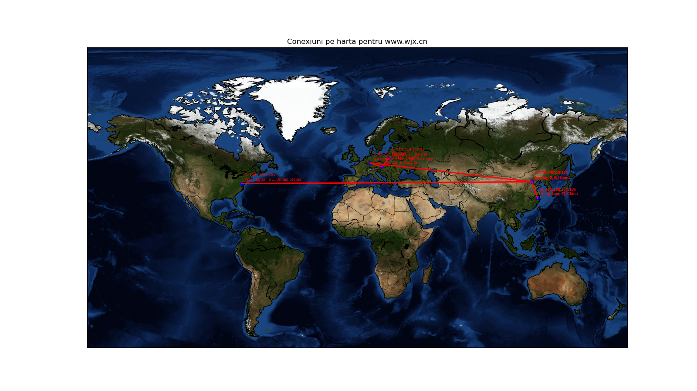
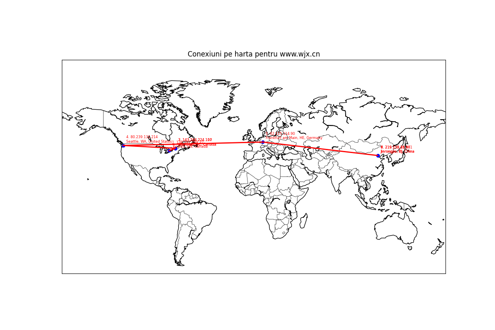

There are pairs of files: a text file which contains the ip addresses which the packet travels, and a world map which shows the points through which the pakcet goes
Here is an example how these files should be read:
## Site

- **Main Site**: [www.wjx.cn](www.wjx.cn)

### Locations
From home:
1. ('213.249.122.17', {'country': 'Poland', 'region': '14', 'city': 'Warsaw', 'lat': 52.2297, 'lon': 21.0122})
2. ('62.115.114.110', {'country': 'Austria', 'region': '9', 'city': 'Vienna', 'lat': 48.2082, 'lon': 16.3738})
3. ('62.115.137.202', {'country': 'Germany', 'region': 'HE', 'city': 'Frankfurt am Main', 'lat': 50.1109, 'lon': 8.68213})
4. ('202.97.70.141', {'country': 'China', 'region': 'BJ', 'city': 'Beijing', 'lat': 39.9042, 'lon': 116.407})
5. ('154.54.59.182', {'country': 'United States', 'region': 'DC', 'city': 'Washington', 'lat': 38.894, 'lon': -77.0365})
6. ('219.158.17.225', {'country': 'China', 'region': 'BJ', 'city': 'Jinrongjie', 'lat': 39.9175, 'lon': 116.362})
7. ('219.158.10.77', {'country': 'China', 'region': 'BJ', 'city': 'Jinrongjie', 'lat': 39.9175, 'lon': 116.362})
8. ('220.191.200.186', {'country': 'China', 'region': 'ZJ', 'city': 'Hangzhou', 'lat': 30.2705, 'lon': 120.164})
9. ('115.238.21.113', {'country': 'China', 'region': 'ZJ', 'city': 'Hangzhou', 'lat': 30.2742, 'lon': 120.155})

From the vps:
1. ('138.197.249.32', {'country': 'Canada', 'region': 'ON', 'city': 'Toronto', 'lat': 43.6547, 'lon': -79.3623})
2. ('143.244.224.110', {'country': 'Canada', 'region': 'QC', 'city': 'Montreal', 'lat': 45.5019, 'lon': -73.5674})
3. ('143.244.224.107', {'country': 'Canada', 'region': 'QC', 'city': 'Montreal', 'lat': 45.5019, 'lon': -73.5674})
4. ('80.239.132.214', {'country': 'United States', 'region': 'WA', 'city': 'Seattle', 'lat': 47.6137, 'lon': -122.338})
5. ('62.115.114.90', {'country': 'Germany', 'region': 'HE', 'city': 'Frankfurt am Main', 'lat': 50.1109, 'lon': 8.68213})
6. ('219.158.41.97', {'country': 'China', 'region': 'BJ', 'city': 'Jinrongjie', 'lat': 39.9175, 'lon': 116.362})
7. ('219.158.15.161', {'country': 'China', 'region': 'BJ', 'city': 'Jinrongjie', 'lat': 39.9175, 'lon': 116.362})
8. ('219.158.10.9', {'country': 'China', 'region': 'BJ', 'city': 'Jinrongjie', 'lat': 39.9175, 'lon': 116.362})

## Diagram

Below is a visual representation of the path:

From home:

From vps:
